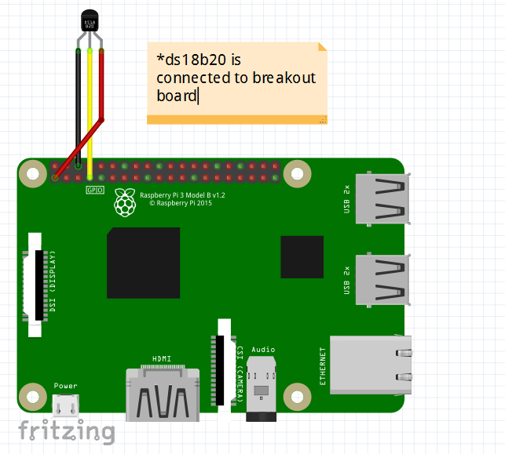
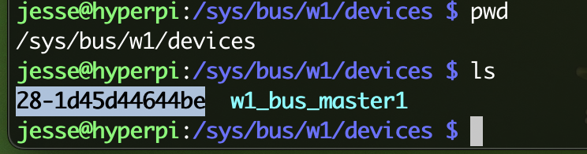
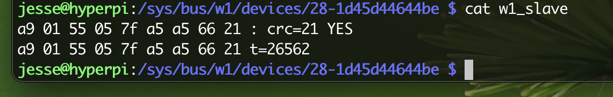

- [Summary](#summary)
  - [Raspberry Pi](#raspberry-pi-details)
  - [Raspberry Pi Camera](#raspberry-camera)
  - [Raspberry Pi Sensor](#raspberry-pi-temperature-sensor)
  - [Raspberry Pi Sensor Setup](#raspberry-pi-temp-sensor-setup)

## Summary
An application written in Go to capture ds18b20 temperature information. An alternative to applications written in Python. Additionally, this appliation is to work with a sensor to trigger a camera recording--again in Golang versus Python. Most examples as of today are mainly writen in Python. 

## Raspberry Pi Details
Model: Raspberry Pi 4 Model B Rev 1.4, 8GB

### Raspberry Pi Camera
* Camera: Raspberry Pi Camera Module V2-8 Megapixel,1080p (RPI-CAM-V2)
* Memory: 12GB
* Sony Exmor IMX219 Sensor Capable of 4K30 1080P60 720P180 8MP Still
* Maximum of 1080P30 and 8MP Stills in Raspberry Pi Board

### Raspberry Pi Temperature Sensor
* DS18B20 Waterproof Temperature Sensor Module DS18B20
* 1m Wire Digital Thermometer Probe Terminal Adapter
* Temperature Sensor Supply Voltage: 3.0V ~ 5.25V
* How to Wire, source (piddlerintheroot.com)

### Raspberry Pi Temp Sensor Setup
* Edit `config.txt` in `/boot/firmware/`
  * Add: `dtoverlay=w1-gpio`, save.
* reboot `sudo reboot`
* `sudo modprobe w1-gpio`
* `sudo modprobe w1-therm`
* Navigate to `cd /sys/bus/w1/devices`
* If all is wired and configured correct to this point. You should see something similar to: 

